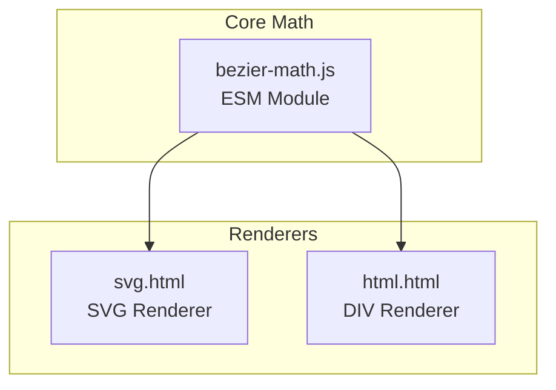
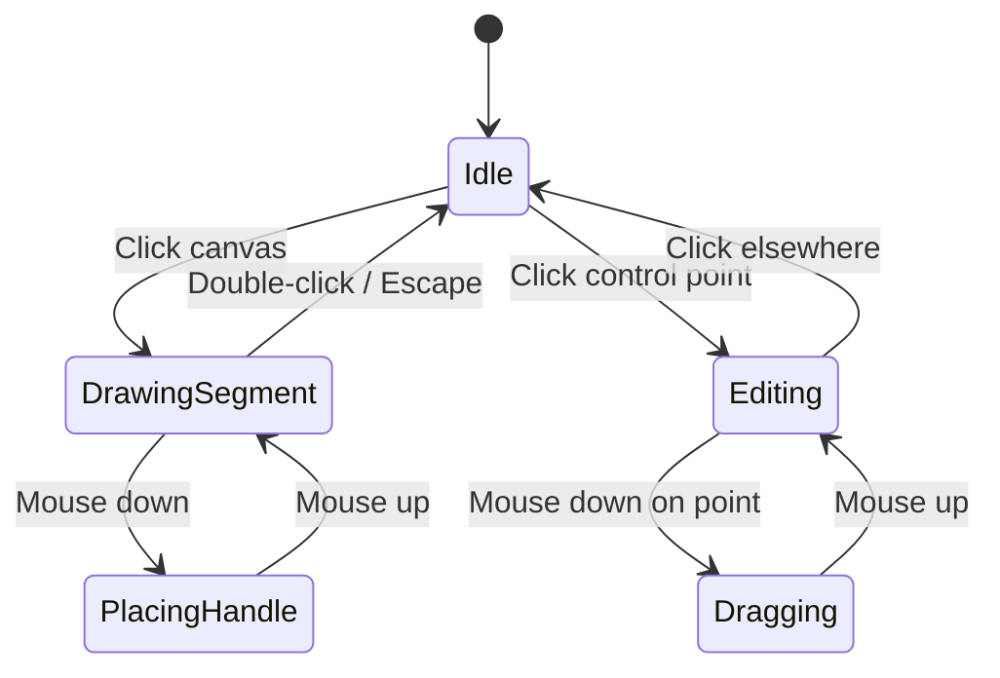

# Interactive Cubic Bézier Workshop

An interactive 2D workshop for drawing cubic (4-point) Bézier curves with mouse interaction, supporting C¹/C² continuity control between segments.

---

## Architecture Overview



---

## File Structure

```
├── bezier-math.js    # Core ESM math module
├── svg.html          # SVG-based interactive editor
└── html.html         # DIV-based interactive editor (tilted divs)
```

---

## 1. Core Math Module: `bezier-math.js`

All functions are **individually exported** for tree-shaking and modularity.  
Each function **must** include a JSDoc comment block with TypeScript types.

### 1.0 Type Definitions

```javascript
/**
 * @typedef {Object} Point
 * @property {number} x - The x-coordinate
 * @property {number} y - The y-coordinate
 */

/**
 * @typedef {Object} Segment
 * @property {Point} p0 - Start anchor point
 * @property {Point} p1 - First control point (outgoing from p0)
 * @property {Point} p2 - Second control point (incoming to p3)
 * @property {Point} p3 - End anchor point
 */

/**
 * @typedef {Object} BoundingBox
 * @property {Point} min - Minimum corner (top-left)
 * @property {Point} max - Maximum corner (bottom-right)
 */

/**
 * @typedef {Object} NearestPointResult
 * @property {Point} point - The closest point on the curve
 * @property {number} t - The parameter value at the closest point (0-1)
 */
```

---

### 1.1 Point Operations

```javascript
/**
 * Creates a 2D point object with x and y coordinates.
 *
 * @param {number} x - The x-coordinate of the point
 * @param {number} y - The y-coordinate of the point
 * @returns {Point} A new point object {x, y}
 * @example
 * const p = createPoint(100, 200);
 * // Returns: { x: 100, y: 200 }
 */
export function createPoint(x, y) {}

/**
 * Performs vector addition of two points.
 * Adds the x and y components of both points together.
 *
 * @param {Point} p1 - The first point (addend)
 * @param {Point} p2 - The second point (addend)
 * @returns {Point} A new point representing p1 + p2
 * @example
 * addPoints({ x: 10, y: 20 }, { x: 5, y: 15 });
 * // Returns: { x: 15, y: 35 }
 */
export function addPoints(p1, p2) {}

/**
 * Performs vector subtraction of two points.
 * Subtracts the x and y components of p2 from p1.
 *
 * @param {Point} p1 - The point to subtract from (minuend)
 * @param {Point} p2 - The point to subtract (subtrahend)
 * @returns {Point} A new point representing p1 - p2
 * @example
 * subtractPoints({ x: 10, y: 20 }, { x: 5, y: 15 });
 * // Returns: { x: 5, y: 5 }
 */
export function subtractPoints(p1, p2) {}

/**
 * Scales a point by a scalar value (scalar multiplication).
 * Multiplies both x and y components by the given scalar.
 *
 * @param {Point} p - The point to scale
 * @param {number} scalar - The scalar multiplier
 * @returns {Point} A new point with scaled coordinates
 * @example
 * scalePoint({ x: 10, y: 20 }, 2);
 * // Returns: { x: 20, y: 40 }
 */
export function scalePoint(p, scalar) {}

/**
 * Calculates the Euclidean distance between two points.
 * Uses the formula: √((x₂-x₁)² + (y₂-y₁)²)
 *
 * @param {Point} p1 - The first point
 * @param {Point} p2 - The second point
 * @returns {number} The distance between p1 and p2
 * @example
 * distance({ x: 0, y: 0 }, { x: 3, y: 4 });
 * // Returns: 5
 */
export function distance(p1, p2) {}

/**
 * Performs linear interpolation between two points.
 * When t=0 returns p1, when t=1 returns p2, values between
 * return points along the line segment connecting p1 and p2.
 *
 * @param {Point} p1 - The starting point (t=0)
 * @param {Point} p2 - The ending point (t=1)
 * @param {number} t - Interpolation parameter, typically in range [0, 1]
 * @returns {Point} The interpolated point: p1 + t * (p2 - p1)
 * @example
 * lerp({ x: 0, y: 0 }, { x: 100, y: 100 }, 0.5);
 * // Returns: { x: 50, y: 50 }
 */
export function lerp(p1, p2, t) {}
```

---

### 1.2 Cubic Bézier Calculations

```javascript
/**
 * Evaluates a cubic Bézier curve at parameter t.
 * Uses the cubic Bézier formula:
 * B(t) = (1-t)³·P₀ + 3(1-t)²t·P₁ + 3(1-t)t²·P₂ + t³·P₃
 *
 * @param {Point} p0 - Start anchor point (curve passes through this)
 * @param {Point} p1 - First control point (influences curve direction from p0)
 * @param {Point} p2 - Second control point (influences curve direction to p3)
 * @param {Point} p3 - End anchor point (curve passes through this)
 * @param {number} t - Parameter value in range [0, 1]
 *                     t=0 returns p0, t=1 returns p3
 * @returns {Point} The point on the curve at parameter t
 * @example
 * cubicBezier(
 *   { x: 0, y: 0 },
 *   { x: 50, y: 100 },
 *   { x: 150, y: 100 },
 *   { x: 200, y: 0 },
 *   0.5
 * );
 */
export function cubicBezier(p0, p1, p2, p3, t) {}

/**
 * Computes the first derivative (tangent vector) of a cubic Bézier curve at t.
 * The derivative gives the direction and speed of movement along the curve.
 * Formula: B'(t) = 3(1-t)²(P₁-P₀) + 6(1-t)t(P₂-P₁) + 3t²(P₃-P₂)
 *
 * @param {Point} p0 - Start anchor point
 * @param {Point} p1 - First control point
 * @param {Point} p2 - Second control point
 * @param {Point} p3 - End anchor point
 * @param {number} t - Parameter value in range [0, 1]
 * @returns {Point} The tangent vector at parameter t (not normalized)
 * @example
 * // Get tangent at midpoint of curve
 * const tangent = cubicBezierDerivative(p0, p1, p2, p3, 0.5);
 * // Normalize for direction: { x: tangent.x / len, y: tangent.y / len }
 */
export function cubicBezierDerivative(p0, p1, p2, p3, t) {}

/**
 * Computes the second derivative of a cubic Bézier curve at t.
 * Indicates how the tangent is changing - related to curvature.
 * Formula: B''(t) = 6(1-t)(P₂-2P₁+P₀) + 6t(P₃-2P₂+P₁)
 *
 * @param {Point} p0 - Start anchor point
 * @param {Point} p1 - First control point
 * @param {Point} p2 - Second control point
 * @param {Point} p3 - End anchor point
 * @param {number} t - Parameter value in range [0, 1]
 * @returns {Point} The second derivative vector at parameter t
 * @example
 * // Used for curvature calculations
 * const accel = cubicBezierSecondDerivative(p0, p1, p2, p3, 0.5);
 */
export function cubicBezierSecondDerivative(p0, p1, p2, p3, t) {}

/**
 * Samples a cubic Bézier curve into an array of points for rendering.
 * Creates evenly-spaced parameter values and evaluates the curve at each.
 *
 * @param {Point} p0 - Start anchor point
 * @param {Point} p1 - First control point
 * @param {Point} p2 - Second control point
 * @param {Point} p3 - End anchor point
 * @param {number} segments - Number of line segments to divide the curve into
 *                            (returns segments + 1 points)
 * @returns {Point[]} Array of points along the curve
 * @example
 * // Sample curve into 50 segments (51 points)
 * const points = sampleCurve(p0, p1, p2, p3, 50);
 * // points[0] === p0, points[50] === p3
 */
export function sampleCurve(p0, p1, p2, p3, segments) {}
```

---

### 1.3 Continuity Enforcement

```javascript
/**
 * Enforces C⁰ (positional) continuity between two segments.
 * Ensures the end point of the previous segment matches the
 * start point of the next segment.
 *
 * @param {Segment} prevSegment - The preceding Bézier segment
 * @param {Segment} nextSegment - The following Bézier segment to modify
 * @returns {Segment} Modified nextSegment with p0 = prevSegment.p3
 * @example
 * const adjusted = enforceC0(segment1, segment2);
 * // adjusted.p0 === segment1.p3
 */
export function enforceC0(prevSegment, nextSegment) {}

/**
 * Enforces C¹ (tangent) continuity between two segments.
 * The tangent vectors at the junction point are equal in both
 * direction and magnitude, creating a smooth transition.
 * Modifies nextSegment.p0 and nextSegment.p1.
 * Formula: nextP1 = 2 * prevP3 - prevP2
 *
 * @param {Segment} prevSegment - The preceding Bézier segment
 * @param {Segment} nextSegment - The following Bézier segment to modify
 * @returns {Segment} Modified nextSegment with C¹ continuous junction
 * @example
 * const adjusted = enforceC1(segment1, segment2);
 * // adjusted.p1 is positioned to match tangent from segment1
 */
export function enforceC1(prevSegment, nextSegment) {}

/**
 * Enforces C² (curvature) continuity between two segments.
 * Both tangent and curvature match at the junction, providing
 * the smoothest possible transition. Modifies nextSegment.p0,
 * nextSegment.p1, and nextSegment.p2.
 * Formulas:
 *   nextP1 = 2 * prevP3 - prevP2
 *   nextP2 = 4 * prevP3 - 4 * prevP2 + prevP1
 *
 * @param {Segment} prevSegment - The preceding Bézier segment
 * @param {Segment} nextSegment - The following Bézier segment to modify
 * @returns {Segment} Modified nextSegment with C² continuous junction
 * @example
 * const adjusted = enforceC2(segment1, segment2);
 * // Both tangent AND curvature match at junction
 */
export function enforceC2(prevSegment, nextSegment) {}

/**
 * Calculates the position for the next segment's first control point (P1)
 * to achieve C¹ continuity with the previous segment.
 * The new P1 is the reflection of prevP2 across prevP3.
 *
 * @param {Point} prevP2 - The second control point of the previous segment
 * @param {Point} prevP3 - The end anchor of the previous segment
 *                         (which is also the start of the next segment)
 * @returns {Point} The calculated position for nextSegment.p1
 * @example
 * const newP1 = calculateC1Handle(segment.p2, segment.p3);
 * // newP1 creates smooth tangent continuation
 */
export function calculateC1Handle(prevP2, prevP3) {}

/**
 * Calculates the position for the next segment's first control point (P1)
 * to achieve C² continuity with the previous segment.
 * Ensures both tangent and curvature continuity.
 *
 * @param {Point} prevP1 - The first control point of the previous segment
 * @param {Point} prevP2 - The second control point of the previous segment
 * @param {Point} prevP3 - The end anchor of the previous segment
 * @returns {Point} The calculated position for nextSegment.p1
 * @example
 * const newP1 = calculateC2Handle(seg.p1, seg.p2, seg.p3);
 * // newP1 creates smooth curvature continuation
 */
export function calculateC2Handle(prevP1, prevP2, prevP3) {}
```

---

### 1.4 Curve Utilities

```javascript
/**
 * Approximates the arc length of a cubic Bézier curve.
 * Samples the curve into line segments and sums their lengths.
 * Higher segment count = more accurate but slower.
 *
 * @param {Point} p0 - Start anchor point
 * @param {Point} p1 - First control point
 * @param {Point} p2 - Second control point
 * @param {Point} p3 - End anchor point
 * @param {number} [segments=100] - Number of segments for approximation
 * @returns {number} Approximate arc length in the same units as coordinates
 * @example
 * const len = curveLength(p0, p1, p2, p3, 100);
 * console.log(`Curve is approximately ${len}px long`);
 */
export function curveLength(p0, p1, p2, p3, segments = 100) {}

/**
 * Splits a cubic Bézier curve at parameter t using De Casteljau's algorithm.
 * Returns two new segments that together represent the original curve.
 *
 * @param {Point} p0 - Start anchor point
 * @param {Point} p1 - First control point
 * @param {Point} p2 - Second control point
 * @param {Point} p3 - End anchor point
 * @param {number} t - Split point parameter in range [0, 1]
 * @returns {[Segment, Segment]} Two segments: [0,t] portion and [t,1] portion
 * @example
 * const [first, second] = splitCurve(p0, p1, p2, p3, 0.5);
 * // first covers the first half, second covers the second half
 */
export function splitCurve(p0, p1, p2, p3, t) {}

/**
 * Computes the axis-aligned bounding box of a cubic Bézier curve.
 * Finds the minimum and maximum x and y values the curve reaches.
 * Considers control points and computes extrema from derivative roots.
 *
 * @param {Point} p0 - Start anchor point
 * @param {Point} p1 - First control point
 * @param {Point} p2 - Second control point
 * @param {Point} p3 - End anchor point
 * @returns {BoundingBox} Object with min and max corner points
 * @example
 * const { min, max } = boundingBox(p0, p1, p2, p3);
 * // min = { x: leftmost, y: topmost }
 * // max = { x: rightmost, y: bottommost }
 */
export function boundingBox(p0, p1, p2, p3) {}
```

---

### 1.5 Hit Testing

```javascript
/**
 * Checks if a point is within a given tolerance distance from the curve.
 * Useful for detecting mouse clicks/hovers on a curve.
 *
 * @param {Point} p0 - Start anchor point
 * @param {Point} p1 - First control point
 * @param {Point} p2 - Second control point
 * @param {Point} p3 - End anchor point
 * @param {Point} point - The point to test (e.g., mouse position)
 * @param {number} tolerance - Maximum distance in pixels to consider "on curve"
 * @returns {boolean} True if point is within tolerance of the curve
 * @example
 * const isHit = pointOnCurve(p0, p1, p2, p3, mousePos, 5);
 * if (isHit) {
 *   highlightCurve();
 * }
 */
export function pointOnCurve(p0, p1, p2, p3, point, tolerance) {}

/**
 * Finds the closest point on the curve to a given point.
 * Returns both the closest point coordinates and the parameter t.
 * Uses sampling to approximate the nearest point.
 *
 * @param {Point} p0 - Start anchor point
 * @param {Point} p1 - First control point
 * @param {Point} p2 - Second control point
 * @param {Point} p3 - End anchor point
 * @param {Point} point - The reference point to find nearest to
 * @param {number} [segments=100] - Number of samples for search accuracy
 * @returns {NearestPointResult} Object with closest point and its t value
 * @example
 * const { point: closest, t } = nearestPointOnCurve(
 *   p0, p1, p2, p3, mousePos, 100
 * );
 * console.log(`Closest point at t=${t}: (${closest.x}, ${closest.y})`);
 */
export function nearestPointOnCurve(p0, p1, p2, p3, point, segments = 100) {}
```

---

### 1.6 Rendering Helpers (for DIV approach)

```javascript
/**
 * Calculates the angle (in degrees) of the line segment from p1 to p2.
 * Used for CSS transform: rotate() when rendering curve segments as DIVs.
 * Angle is measured clockwise from the positive x-axis.
 *
 * @param {Point} p1 - Starting point of the segment
 * @param {Point} p2 - Ending point of the segment
 * @returns {number} Angle in degrees (0-360), suitable for CSS rotation
 * @example
 * const angle = segmentAngle({ x: 0, y: 0 }, { x: 100, y: 100 });
 * // Returns: 45 (degrees)
 * div.style.transform = `rotate(${angle}deg)`;
 */
export function segmentAngle(p1, p2) {}

/**
 * Calculates the length of a line segment between two points.
 * Used for CSS width when rendering curve segments as DIVs.
 * This is a convenience wrapper around the distance function.
 *
 * @param {Point} p1 - Starting point of the segment
 * @param {Point} p2 - Ending point of the segment
 * @returns {number} Length in the same units as coordinates (pixels)
 * @example
 * const len = segmentLength({ x: 0, y: 0 }, { x: 3, y: 4 });
 * // Returns: 5
 * div.style.width = `${len}px`;
 */
export function segmentLength(p1, p2) {}
```

---

## 2. SVG Implementation: `svg.html`

### 2.1 Features

- **Drawing**: Click to place anchor points; drag to adjust control handles
- **Editing**: Select and drag any control point
- **Continuity Toggle**: UI to switch between Independent / C¹ / C² modes per joint
- **Visual Feedback**:
  - Anchor points (squares)
  - Control points (circles)
  - Control handles (dashed lines)
  - Curve path (solid line)

### 2.2 SVG Elements Used

| Element    | Purpose                                   |
| ---------- | ----------------------------------------- |
| `<path>`   | Render Bézier curves using `C` command    |
| `<circle>` | Control points                            |
| `<rect>`   | Anchor points                             |
| `<line>`   | Handle lines connecting anchor to control |

### 2.3 Interaction Flow



---

## 3. DIV Implementation: `html.html`

### 3.1 Rendering Technique

Curves are approximated as a series of small **rotated `<div>` elements**:

```
┌────────────────┐
│ Sample curve   │
│ into N points  │
└───────┬────────┘
        ▼
┌────────────────┐
│ For each pair  │
│ of adjacent    │
│ points:        │
│  - Create div  │
│  - Set width   │
│  - Set rotation│
│  - Position    │
└────────────────┘
```

Each segment DIV:

- `width`: distance between points
- `height`: 2px (line thickness)
- `transform`: `rotate(θ)` where θ = angle between points
- `position`: absolute, placed at midpoint

### 3.2 Features

- Same interaction model as SVG version
- Control points rendered as positioned `<div>` elements
- Real-time re-sampling on drag

### 3.3 Performance Considerations

| Setting                 | Description                                    |
| ----------------------- | ---------------------------------------------- |
| `SEGMENTS_PER_CURVE`    | Number of div segments per curve (default: 50) |
| `requestAnimationFrame` | Throttle updates during drag                   |

---

## 4. Continuity Modes

### 4.1 Visual Legend

| Mode            | Symbol | Behavior                                          |
| --------------- | ------ | ------------------------------------------------- |
| **Independent** | ◇      | No constraints between segments                   |
| **C¹ (G¹)**     | ○      | Tangent vectors are collinear and equal magnitude |
| **C²**          | ●      | Matching curvature at junction                    |

### 4.2 Mathematical Definitions

**C⁰ Continuity** (always enforced):

```
Segment[n].P3 === Segment[n+1].P0
```

**C¹ Continuity**:

```
Segment[n+1].P1 = 2 * Segment[n].P3 - Segment[n].P2
```

**C² Continuity**:

```
Segment[n+1].P1 = 2 * Segment[n].P3 - Segment[n].P2
Segment[n+1].P2 = 4 * Segment[n].P3 - 4 * Segment[n].P2 + Segment[n].P1
```

---

## 5. User Interface Controls

Both implementations share:

| Control                         | Function                                 |
| ------------------------------- | ---------------------------------------- |
| **Shift+click** canvas          | Start new curve at click position        |
| **Ctrl+click** canvas           | Extend from selected endpoint            |
| **Drag** any point              | Move point freely                        |
| **Ctrl+drag** control point     | Maintain continuity (mirror to neighbor) |
| **Ctrl+click** anchor           | Delete anchor point                      |
| **Space+drag**                  | Pan entire canvas                        |
| **Click** endpoint (first/last) | Select endpoint for extension            |
| **Click** outside canvas        | Enter focus mode (hide controls)         |
| **Escape** key                  | Enter focus mode (hide controls)         |
| **Click** on canvas             | Exit focus mode (show controls)          |
| **Continuity dropdown**         | Set mode for junctions                   |
| **Export JSON button**          | Download curve data as JSON file         |
| **Copy URL button**             | Copy shareable URL to clipboard          |
| **Clear All button**            | Reset canvas                             |

---

## 6. Data Model

```javascript
// Single cubic Bézier segment
const segment = {
  p0: { x, y },  // Start anchor
  p1: { x, y },  // Control point 1 (outgoing from p0)
  p2: { x, y },  // Control point 2 (incoming to p3)
  p3: { x, y }   // End anchor
};

// Full path with continuity info
const path = {
  segments: [segment, segment, ...],
  continuity: ['independent', 'c1', 'c2', ...]  // Per junction
};
```

---

## 7. Verification Plan

### 7.1 Manual Testing

Since this is a visual, interactive application, verification is primarily manual:

1. **Math Module Testing**
   - Open browser console on either HTML file
   - Call exported functions directly and verify results
   - Example: `import { cubicBezier } from './bezier-math.js'`

2. **SVG Rendering**
   - Draw a 3-segment curve
   - Verify smooth visual appearance
   - Toggle continuity modes and observe handle adjustments

3. **DIV Rendering**
   - Same tests as SVG
   - Verify divs are properly rotated and positioned
   - Check performance with rapid dragging

4. **Continuity Enforcement**
   - Create multi-segment curve
   - Switch junction from Independent → C¹ → C²
   - Verify handles snap to correct positions

### 7.2 User Acceptance

> [!IMPORTANT]
> The user should manually test interactive drawing and continuity switching in both implementations.

---

## 8. Implementation Order

1. `bezier-math.js` — Core math functions
2. `svg.html` — SVG renderer with interactions
3. `html.html` — DIV renderer (reuses interaction logic)

---

## 9. URL Serialization Format

### 9.1 Design Goals

- **URL-safe**: Use only characters that `encodeURIComponent` does NOT escape
- **Compact**: Minimize URL length for sharing
- **Human-readable**: Reasonably parseable by inspection
- **Complete**: Store all curve data including continuity modes

### 9.2 Safe Characters

`encodeURIComponent` leaves these characters **unencoded**:

| Type         | Characters                          |
| ------------ | ----------------------------------- |
| Alphanumeric | `A-Z`, `a-z`, `0-9`                 |
| Special      | `-` `_` `.` `!` `~` `*` `'` `(` `)` |

Characters to **avoid** (these get percent-encoded):

- `,` `:` `;` `/` `?` `#` `&` `=` `+` `@` `$` `%` `[` `]` `{` `}` `<` `>` `|` `\` `^` `` ` `` `"` and space

### 9.3 Proposed Format

```
<curve>!<curve>!<curve>
```

Each `<curve>` is:

```
<segment>-<continuity><segment>-<continuity><segment>
```

Each `<segment>` is:

```
<x0>~<y0>_<x1>~<y1>_<x2>~<y2>_<x3>~<y3>
```

| Delimiter | Purpose                           |
| --------- | --------------------------------- |
| `!`       | Separates independent curves      |
| `-`       | Separates segments within a curve |
| `_`       | Separates points within a segment |
| `~`       | Separates x and y coordinates     |

### 9.4 Continuity Encoding

After each `-` segment separator, a single letter indicates continuity mode:

| Letter | Mode                        |
| ------ | --------------------------- |
| `i`    | Independent (no constraint) |
| `t`    | C¹ Tangent continuity       |
| `c`    | C² Curvature continuity     |

### 9.5 Coordinate Encoding

- **Integers**: Use plain numbers (e.g., `150`, `-30`)
- **Decimals**: Use `.` (e.g., `150.5`)
- **Negative**: Use `n` prefix instead of `-` to avoid conflict with segment separator (e.g., `n30` = -30)

### 9.6 Full Example

**Two curves:**

- Curve 1: Two segments with C¹ continuity at junction
  - Segment 1: p0(100,200) p1(150,250) p2(180,280) p3(200,300)
  - Segment 2: p0(200,300) p1(220,320) p2(250,350) p3(270,400)
- Curve 2: One segment
  - Segment 1: p0(50,50) p1(80,100) p2(120,150) p3(150,200)

**Serialized:**

```
100~200_150~250_180~280_200~300-t200~300_220~320_250~350_270~400!50~50_80~100_120~150_150~200
```

**Structure breakdown:**

```
100~200_150~250_180~280_200~300   ← Curve1, Segment1
-t                                ← C¹ continuity joint
200~300_220~320_250~350_270~400   ← Curve1, Segment2
!                                 ← New curve
50~50_80~100_120~150_150~200      ← Curve2, Segment1
```

### 9.7 Parsing Algorithm

```javascript
function parseURL(str) {
  return str.split("!").map((curveStr) => {
    const segments = [];
    const continuity = [];

    // Split by continuity markers (-i, -t, -c) or plain dash
    const parts = curveStr.split(/-(i|t|c)?/);

    for (let i = 0; i < parts.length; i++) {
      const part = parts[i];
      if (!part) continue;

      if (part === "i" || part === "t" || part === "c") {
        continuity.push(part === "i" ? "independent" : part === "t" ? "c1" : "c2");
      } else {
        segments.push(parseSegment(part));
      }
    }
    return { segments, continuity };
  });
}

function parseSegment(str) {
  const points = str.split("_").map((p) => {
    const [x, y] = p.split("~").map(parseCoord);
    return { x, y };
  });
  return { p0: points[0], p1: points[1], p2: points[2], p3: points[3] };
}

function parseCoord(c) {
  return c.startsWith("n") ? -parseFloat(c.slice(1)) : parseFloat(c);
}
```

### 9.8 URL Integration

Store in URL hash for easy sharing:

```
https://example.com/svg.html#100~200_150~250_180~280_200~300
```

Or use query parameter:

```
https://example.com/svg.html?d=100~200_150~250_180~280_200~300
```

---

## 10. Focus Mode (Clean View)

When working with curves, control points and helper lines can be hidden to see only the raw curve output.

### 10.1 Behavior

| User Action                  | Result                                             |
| ---------------------------- | -------------------------------------------------- |
| Click **outside** the canvas | Hide control points, handles, and junction squares |
| Press **Escape** key         | Hide control points, handles, and junction squares |
| Click **on** the canvas      | Show all editing UI elements                       |
| Click on **toolbar/sidebar** | No change (maintains current focus state)          |

### 10.2 What Gets Hidden

- Control point circles (p1, p2)
- Anchor point squares (p0, p3)
- Handle/arm lines (dashed lines connecting anchors to control points)

### 10.3 What Stays Visible

- Curve paths (the actual Bézier curves)

### 10.4 Use Cases

- **Preview mode**: See the final curve without editing clutter
- **Screenshots**: Capture clean curve visuals
- **Presentations**: Show only the output curves

---

## 11. Performance Optimizations

### 11.1 Debounced URL Updates

URL hash updates are debounced to prevent excessive browser history manipulation and CPU usage during drag operations.

```javascript
// URL updates are debounced with 300ms delay
const debouncedUpdateURLHash = debounce(updateURLHash, 300);
```

**Before**: URL updated on every `mousemove` during drag → high CPU usage  
**After**: URL updates 300ms after last interaction → smooth dragging

---

## Open Questions

> [!NOTE]
> Please confirm or adjust these decisions:

1. **Curve colors**: Should curves be a single color or support per-segment coloring?
2. **Control point size**: Default 8px for anchors, 6px for handles—acceptable?
3. **Touch support**: Should we include touch event handlers for mobile?
4. **Undo/Redo**: Is this required for initial version?

# Dev note

for testing use server http://0.0.0.0:4385.

you can make sure about port in .env file.

Assume it is running. I will make sure it will run
